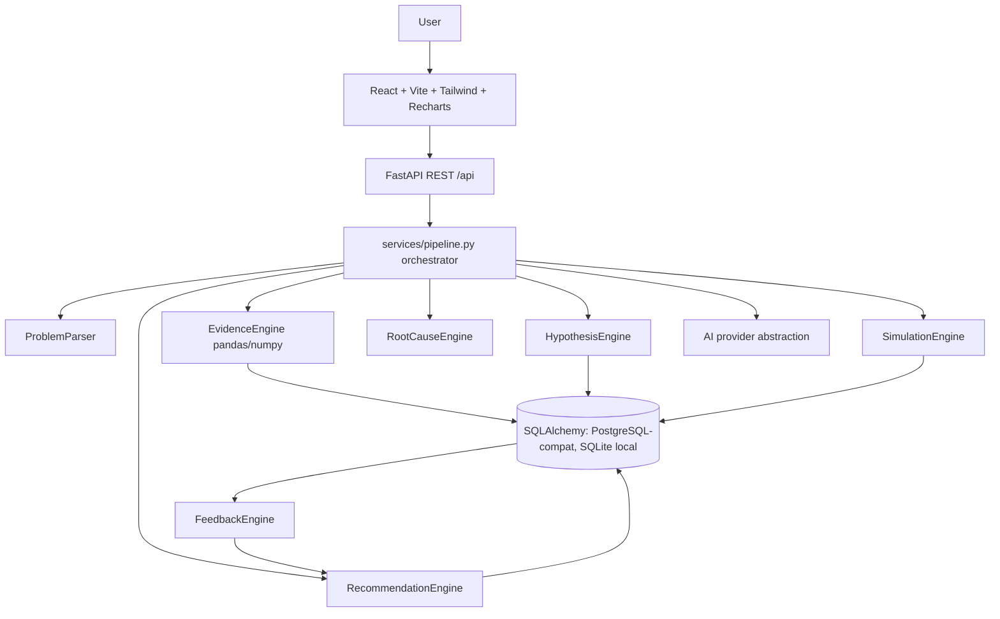

# Architecture

## Backend layout (`backend/app/`)

- `main.py` — FastAPI app, CORS, DB init
- `api/routes.py` — REST endpoints
- `db.py` / `models_db.py` / `schemas.py` — persistence + validation
- `engines/problem_parser.py` — text → structured problem
- `engines/evidence_engine.py` — pandas profiling, outliers, correlations, trends
- `engines/hypothesis_engine.py` — 5 competing hypotheses, evidence-weighted confidence
- `engines/analysis.py` — root cause, recommendations, simulation, feedback
- `ai/provider.py` — `LLM_PROVIDER` abstraction (demo/generic)
- `services/pipeline.py` — orchestrator; every timeline stage maps to a real operation

## Frontend (`frontend/src/`)

Single-page command center: intake, dashboard, timeline, evidence graph (SVG, clickable),
hypothesis ranking (Recharts), root cause, simulator sliders, action plan + explainer,
feedback loop, CSV upload. Dark/light mode, responsive, keyboard-accessible graph nodes.
